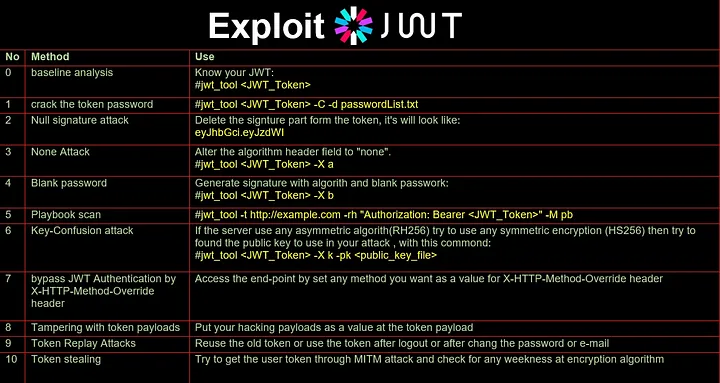

# Tools

- [JWT.io](https://jwt.io/) - Debugging and testing JWT
- [JWK Set Generator](https://mkjwk.org/) - Generate JWK Sets
- [JWT Decoder](https://jwt.io/tools?tab=decode) - Decode JWT
- [GitHub — ticarpi/jwt_tool: A toolkit for testing, tweaking and cracking JSON Web Tokens](https://github.com/ticarpi/jwt_tool) - A toolkit for testing, tweaking and cracking JSON Web Tokens
- [GitHub — hahwul/jwt-hack: 🔩 jwt-hack is tool for hacking / security testing to JWT. Supported for En/decoding JWT, Generate payload for JWT attack and very fast cracking(dict/brutefoce)](https://github.com/hahwul/jwt-hack) - 🔩 jwt-hack is tool for hacking / security testing to JWT. Supported for En/decoding JWT, Generate payload for JWT attack and very fast cracking(dict/brutefoce)
- [GitHub — mazen160/jwt-pwn: Security Testing Scripts for JWT](https://github.com/mazen160/jwt-pwn) - Security Testing Scripts for JWT 
- [GitHub — brendan-rius/c-jwt-cracker: JWT brute force cracker written in C](https://github.com/brendan-rius/c-jwt-cracker) - JWT brute force cracker written in C
- [GitHub — jmaxxz/jwtbrute: Brute forcing jwt tokens signed with HS256 since 2014](https://github.com/jmaxxz/jwtbrute) - Brute forcing jwt tokens signed with HS256 since 2014
- [GitHub — Sjord/jwtcrack: Crack the shared secret of a HS256-signed JWT](https://github.com/Sjord/jwtcrack) - Crack the shared secret of a HS256-signed JWT
- [JSON Web Tokens](https://portswigger.net/bappstore/f923cbf91698420890354c1d8958fee6) - Burp extension to decode JWT
- [JSON Web Token Attacker](https://portswigger.net/bappstore/f923cbf91698420890354c1d8958fee6) - Burp extension to check JWT (JSON Web Tokens) for using keys from known from public sources 
- [GitHub — wallarm/jwt-heartbreaker: The Burp extension to check JWT (JSON Web Tokens) for using keys from known from public sources](https://github.com/wallarm/jwt-heartbreaker) - The Burp extension to check JWT (JSON Web Tokens) for using keys from known from public sources 
-  [JWTweak](https://rishuranjanofficial.github.io/JWTweak/) - JWT Tweak Tool 
- [jwt_tool](https://github.com/ticarpi/jwt_tool) - A toolkit for testing, tweaking and cracking JSON Web Tokens 

## jwt_tool Commands:

- `jwt_tool -d <jwt_token>` - Decode JWT
- `jwt_tool -e <jwt_token>` - Encode JWT
- `jwt_tool -t <jwt_token>` - Test JWT
- `jwt_tool -p <jwt_token>` - Print JWT
- `jwt_tool <JWT_Token> -C -d passwordList.txt` - Crack JWT
- `jwt_tool <JWT_Token> -X n` - Test JWT with n threads
- `jwt_tool <JWT_Token> -X a` - Test JWT with all threads
- `jwt_tool <JWT_Token> -X b` - Test JWT with 1 thread
- `jwt_tool -t http://example.com -rh “Authorization: Bearer <JWT_Token>” -M pb` - Test JWT with proxy
- `jwt_tool <JWT_Token> -X k -pk < public-key-pem >` - Test JWT with public key
- `jwt_tool -h` - Help

